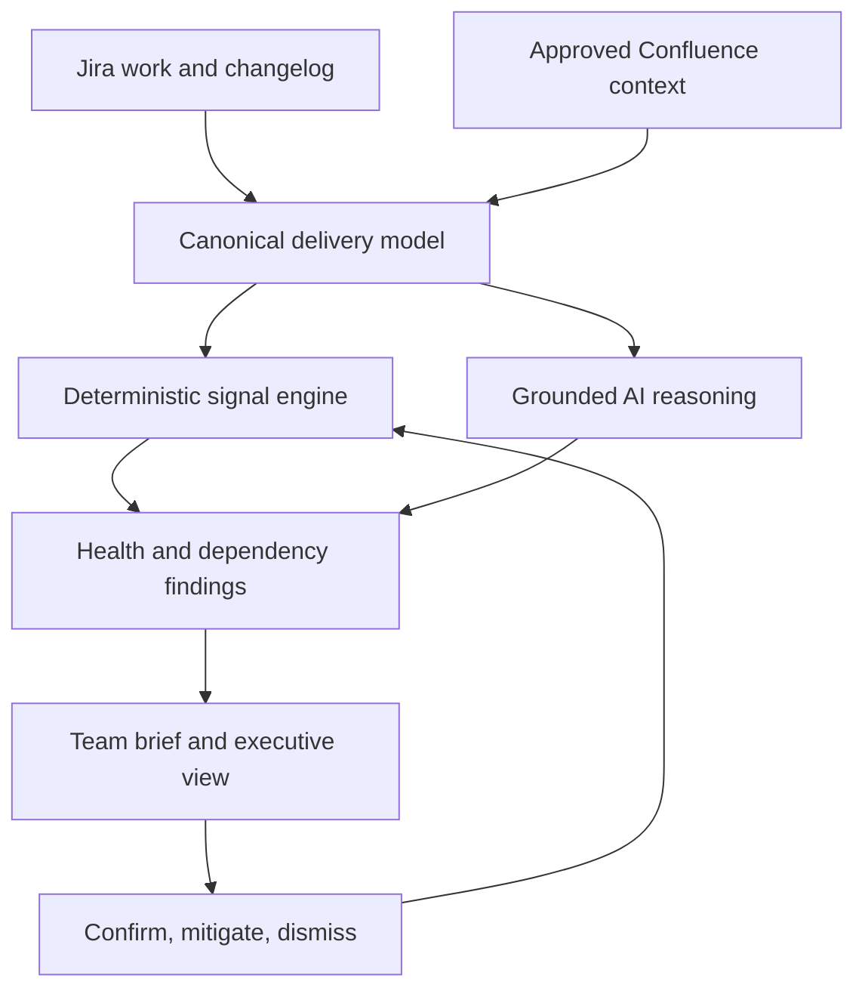

# Scrum Health Intelligence

An explainable, AI-ready reference implementation for turning Jira and Confluence delivery data into early risk signals, dependency insights, and executive product reporting.

This repository pairs a product white paper with runnable source code. The MVP uses sample data and the Python standard library, so it runs without cloud credentials or third-party packages.

## Product thesis

Most delivery dashboards report activity after the fact. Scrum Health Intelligence focuses on **decision lead time**: detecting material delivery risk early enough to mitigate it, explaining the evidence, and turning an accepted signal into an owned action.

The project deliberately avoids individual performance scores and velocity targets. It evaluates goals, flow, dependencies, readiness, and evidence quality.

## What is included

- Responsive executive dashboard and action-oriented risk queue
- Explainable health dimensions and weighted outcome-health index
- Directed dependency analysis using slack, impact, reach, and mitigation coverage
- Evidence-linked deterministic leadership brief with an interface suitable for grounded AI generation
- Sample Jira/Confluence-style domain data
- JSON APIs for health snapshots, risks, dependencies, and briefs
- Automated unit and HTTP smoke tests
- 17-page product white paper under [`docs/`](docs/)

## Quick start

Requires Python 3.11 or newer.

```bash
python -m scrum_health.server
```

Open [http://127.0.0.1:8080](http://127.0.0.1:8080).

Run the test suite:

```bash
python -m unittest discover -s tests -v
```

No Jira, Confluence, or model-provider credentials are needed for the sample experience.

## Next steps

After the sample dashboard is running, follow the [Getting Started and Next Steps guide](docs/getting-started.md) to validate the experience, run tests, review the white paper, connect a Jira sandbox, and plan a responsible live-data pilot.

## API

| Endpoint | Purpose |
| --- | --- |
| `GET /api/health` | Service health check |
| `GET /api/snapshot` | Complete dashboard payload |
| `GET /api/risks` | Ranked, explainable risk findings |
| `GET /api/dependencies` | Dependency edges ranked by exposure |
| `GET /api/brief` | Executive narrative, decisions, and evidence |

## Architecture



The current code implements the canonical models, deterministic signal engine, dependency scoring, findings, brief fallback, API, and dashboard. Production connectors and model-provider adapters are intentional extension points.

## Health model

Each dimension combines transparent, normalized signals:

```text
Risk(d, t) = Σ weight(i) × signal(i, t)
Health(d, t) = 100 − Risk(d, t)
```

Dependency exposure is approximated as:

```text
Exposure = P(delay) × impact × criticality × (1 − mitigation coverage)
```

The dashboard shows component scores, confidence, evidence, and actions rather than relying on one opaque status.

## Production integration roadmap

1. Replace `fixtures.sample_dataset()` with permission-aware Jira Cloud and Confluence Cloud connectors.
2. Persist source snapshots and temporal change history in a tenant-isolated data store.
3. Configure organization-specific workflow mappings, thresholds, and outcome hierarchy.
4. Add a retrieval-grounded model adapter behind `briefing.generate_brief`, requiring structured output and claim-level citations.
5. Implement OAuth, source ACL propagation, audit logs, retention controls, and tenant isolation before using customer data.
6. Calibrate thresholds against historical results and measure precision, lead time, reporting effort, alert burden, and team trust.

## Responsible-use guardrails

- Do not use this system to rank or evaluate individuals.
- Do not treat generated text as verified fact without cited evidence.
- Require human confirmation for inferred dependencies and material decisions.
- Preserve Jira and Confluence source permissions during retrieval and display.
- Monitor alert precision, override rates, evidence coverage, and trust as product guardrails.

## Repository structure

```text
scrum_health/  Domain models, scoring, graph analysis, findings, API service
web/           Dependency-free dashboard
tests/         Unit tests and HTTP smoke tests
docs/          White paper and supporting documentation
```

## Status

This is a product-concept reference implementation, not a production Atlassian application. Formulas, thresholds, sample risks, and AI narratives are hypotheses to validate through customer discovery and controlled pilots.

## License

MIT
